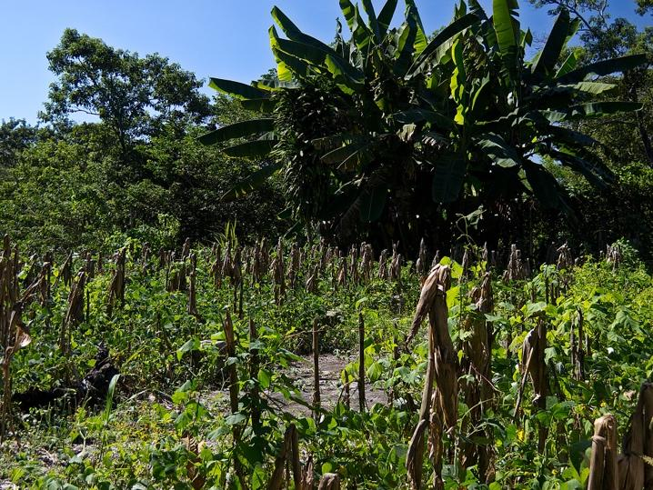
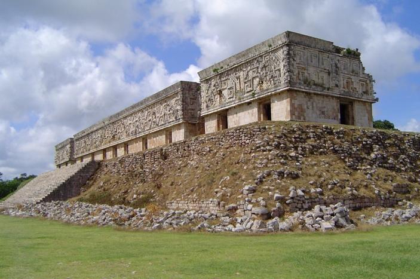
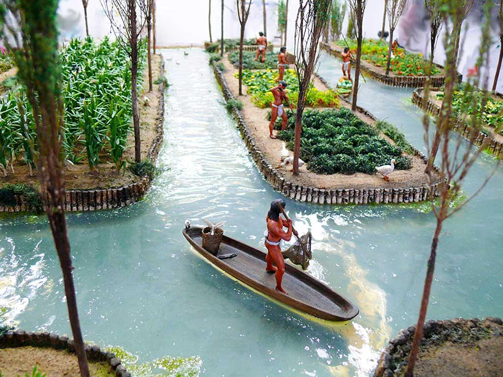

# Brief chronology of technological culture in Mexico

[RAFAEL LOZANO-HEMMER](http://lozano-hemmer.com) · Feburary 1, 2023

This is an incomplete and idiosyncratic list of intersections of technology and culture in Mexico compiled by Rafael Lozano-Hemmer and Tracy Valcourt. It was originally written to accompany the exhibition “Rafael Lozano-Hemmer: TECHS-MECHS” at Gray Area Art Center in San Francisco. It includes contributions from before 1980.

---
 
 
### From Teosinte to Corn - 7,000 BC

Corn is the result of artificial selection of grains of Teosinte grass over many generations of indigenous people in Guerrero, around 9,000 years ago. Without the artificial selection of seeds Teosinte would not have naturally developed into the large corn cobs that we know today.

 
 
### Milpa - 3,000 BC

Biodiverse Mesoamerican agriculture system that offers nutritionally and environmentally complementary crops, typically corn (carbohydrates), beans (lysine and typtophan to make proteins), cucurbita pepo squash (vitamins) and avocados (fats).

 
 
### Banderoles and Volutes - ca 650 BC

In art history a speech scroll (also called a volute, banderole or phylactery) is an illustrative device denoting speech, song, or other types of sound. The device was in use by artists within Mesoamerican cultures from as early as 650 BC until after the in the Spanish conquest in the 16th century. While similar European medieval speech-scrolls were drawn as if they were an actual strip of parchment, Mesoamerican volutes follow the rules of fluid-dynamics such as Navier-Stokes equations, creating eddies and turbulence in the air.

 
 
### Mayan Zero - ca 350

The number zero was used as a placeholder by Mayans over 100 years before it first was used algorithmically in India in 458. Contrary to the Indian zero, which represented emptiness or vacuum, in Mexico zero represented totality, everything.

 
 
### Uxmal - ca 500

The ancient Mayan city features The Governor's Palace which is a classic example of archaeoastronomy, as it is oriented so that every eight years Venus intersects it as seen from the Cehtzuc pyramid 5Km away. This is no coincidence as the Palace has almost 400 glyphs signifying Venus on its facade.

 
 
### Chinampas - ca 1150

Artificial islands or floating gardens created by interweaving reeds, stakes, fertile arable soil, drainage systems, and often secured and protected by bonpland willow and cypress trees. Chinampas were developed by the Aztecs to extend land and grow crops that needed no irrigation and could yield up to 7 harvests a year.

 
 
### Bartolomé de Medina - 1554

In Pachuca Hidalgo, Bartolomé de Medina Invented and patented the "Patio process" to extract silver from ore by using mercury amalgamation, brine and copper sulfate as a catalyst. This invention greatly diminished the trade in African enslaved people.

 
 
### Carlos de Sigüenza y Góngora - 1681

Polymath and writer Carlos de Sigüenza y Góngora wrote the book _Philosophical Manifest Against the Comets Stripped of their Dominion over the Timid (1681)_ in which he categorically separates the fields of astrology and astronomy. His rationalist and anti-superstition treatise greatly influenced future generations of intellectuals.

 
 
### Sor Juana Inés de la Cruz - 1692

Writer, philosopher, composer, and poet of the Baroque period, Sor Juana joined a Hieronymite nunnery in 1667, and began writing poetry and prose dealing with such topics as love, environmentalism, feminism, and religion. Her poem "Primero Sueño" (First Dream), written in 1692, is an ode to knowledge, clarity and rationalism.

 
 
### José Antonio de Alzate y Ramírez - 1772

A nephew of Sor Juana, Alzate was a scientist, philosopher, cartographer and historian who first ascribed the psychedelic effect of entheogenic plants, such as pipiltzintzintli, to natural causes and not the work of the devil. He defended the pre-Columbian use of ololiuqui plants for their anesthetic qualities, and he actively fought for the legislation of medical cannabis. The Antonio Alzate Scientific Society was created in 1884 and later became the National Academy of Sciences in Mexico.

 
 
### Manuel Antonio de Rivas - 1775

Friar Manuel Antonio de Rivas from Mérida wrote "Syzygies and Lunar Quadratures" in 1775. This is considered the first Science Fiction text written in the Americas and included lunar travel, the location of hell in the Sun and doubts about Biblical chronology, for which he was the subject of an inquisition.

 
 
### José Antonio de Alzate y Ramírez - 1790

The great scientist invented the automatic float shutter, the air-filled float in the tank of the great majority of toilets, but also found in all sorts of industrial vats and irrigation systems. This invention has helped greatly reduce the waste of water.

 
 
### Andrés Manuel del Río - 1801

Scientist Andrés Manuel del Río, author of the first mineralogy book in America, contemporary of Lavoisier and Von Humboldt, discovered the metallic element Vanadium from mineral samples from Hidalgo. Vanadium is a key component of many steel alloys, among other contemporary uses.

 
 
### Leona Vicario and Josefa Ortiz de Domínguez - 1810

Mexican feminists who informed, funded, planned and aided the War of Independence from Spain. As the first journalist in Mexico, Vicario encrypted her printed messages in a code that could only be deciphered by the "Los Guadalupes" insurgent group. Separately, Ortiz de Domínguez triggered the insurrection itself, despite being held captive, by tapping a code with her heels so that warden Ignacio Pérez would warn independentists Hidalgo and Allende that they had been betrayed.

 
 
### Ignacio Ramírez "El Nigromante" - 1836

Ignacio Ramírez was a writer, journalist, and politician born in San Miguel de Allende. He wrote the first public school textbooks, advocated for women to vote, and was known as a progressive and principled politician. In his speech in 1836 to the Letrán Academy, he proclaimed "God does not exist, natural beings are self-supporting". This was two years before Darwin's theory of natural selection and forty-six before Nietzsche's proclaimed "God is dead" in "The Gay Science".

 
 
### Juan Nepomuceno Adorno - 1855

In the World's Fair in Paris, inventor and philosopher Juan Nepomuceno Adorno presented his Melopgraph, a device attached to a piano which could automatically transcribe musical notes in a notation on paper.

 
 
### Francisco Estrada Murguía - 1868

Inventor born in San Luis Potosí who, among other advancements, designed an electrical generator dynamo that greatly improved DC output compared to Pacinotti's invention. He sent his designs to be fabricated by French house Breguet, which did not reply and instead built them for Belgian Zénobe Gramme two years later, and this became a staple in industry.

 
 
### Francisco Estrada Murguía - 1886

The inventor patented a wireless system to communicate with moving trains, using a Ruhmkorff induction coil that would emit morse code discharges. This was 10 years before Marconi's own wireless communication.

 
 
### Julián Carrillo - 1895

Julián Carrillo was a composer from San Luis Potosí who proposed microtonal music in 1895, using intervals smaller than half tones. He promoted and perfected his "Thirteenth sound" theory and in 1940 patented fifteen metamorphoser pianos to play his music, —these won the gold medal at the Brussels' World Expo in 1958.

 
 
### Alfonso Luis Herrera - 1904

Developed an experimental science called plasmogeny, concerned with the origin of protoplasm, the living material of which all animals and plants are made. He experimented with creating artificial cells that could have life-like behaviours, for example with sulphobe films, composed of formaldehyde and thiocyanates. He demonstrated the non-biological synthesis of organic compounds, but did not define the boundary between living and inanimate matter.

 
 
### Manuel Mondragón - 1904

General Mondragón patented the world's first gas-operated semi-automatic rifle, the Mondragón rifle, designated the M1908. The rifle was used by Mexican forces in the Mexican Revolution, making Mexico the first nation to use a semi-automatic rifle in battle, in 1911.

 
 
### Juan Guillermo Villasana - 1915

Pioneer aviation figure in Mexico, he designed the "Anahuac Propeller" which used a novel assembly approach using different types of wood. In 1919 this propeller broke the altitude world record which was 19,750 ft at the time.

 
 
### Eduardo Urzáiz - 1919

Writer from Yucatán, author of the dystopian science fiction novel "Eugenia", a precedent to "Brave New World" (1932), "Nineteen Eighty Four" (1948) and "Farenheit 451" (1953). Set in 2218 in the supposedly perfect town of "Villautopia", capital of Central America, eugenics has reached a point where men become pregnant with selected fertilized eggs and family is no longer needed, replaced by groups built by affinity.

 
 
### Estridentismo - Maples Arce, List Arzubide, Lira, Gallardo, and others - 1921

_Estridentismo_ (Stridentism), was an avant-garde artistic and techno-optimist movement founded by poet Manuel Maples Arce. The arrival of radio transmission in Mexico was spearheaded by this movement, who did the first radio broadcasts in the country starting in 1921.

 
 
### Xavier de Icaza - 1926

A Stridentist poet and writer from Durango, in 1926 Icaza wrote and produced "Magnavoz," a performance text in which voices were projected through loudspeakers placed in the craters of replicated Mexican volcanoes. The performance created one of the first polyphonic, multi-channel theatrical presentations.

 
 
### David Alfaro Siqueiros - 1932

Siqueiros was known for his innovative approach to painting using industrial approaches such as synthetic paints, spray guns, photography, and cement "frescoes". In 1932 he was the first to use electric projections to trace his drawings to an architectural scale, and in 1933 he used cameras and projectors placed in the different locations of visitors to create the immersive and polyperspective work "Ejercicio Plástico" in Argentina.

 
 
### Conlon Nancarrow - 1939

In 1939 composer Conlon Nancarrow began his works for mechanical player pianos, creating music which explored complex rhythmic variations beyond the ability of human performers. His polyphonic music derived from strata with different tempi, which required his pianos to be prepared and custom-built punching machines for his piano rolls. In 1947 he created a full robotic percussion orchestra, further bringing automation into his work.

 
 
### González Camarena - 1940

Electrical engineer born in Guadalajara who invented the color-wheel type of colour television. At the age of 23, González Camarena patented a chromoscopic adapter with which black and white cameras of the day could capture color. This technology was later used in NASA's voyager mission to take pictures of Jupiter in 1979.

 
 
### Arturo Rosenblueth - 1943

Rosenbleuth was a researcher, physician and physiologist from Chihuahua, Director of the Mexican Institute of Cardiology. His publication "Behavior, Purpose, and Teleology" (1943), co-authored with American mathematician and philosopher Norbert Weiner, set the basis for the science of cybernetics.

 
 
### Luis Miramontes - 1951

Eminent chemist from Nayarit, Miramontes worked at Mexico's Syntex Laboratory with Carl Djerassi and George Rosenkranz to synthesize norethisterone, the progestin used in one of the first oral contraceptives. "The Pill" has been lauded as one of the most important inventions of the 20th Century.

 
 
### Félix Candela - 1951

Developed and perfected the use of thin shells of reinforced concrete, popularly known as "cascarones" (egg shells), which transformed modern architecture and structural engineering. His Pabellón de Rayos Cósmicos ("Pavilion of Cosmic Rays"), at the National Autonomous University of Mexico, was built in 1951.

 
 
### José Luis Gutiérrez - 1955

Chemist who developed and perfected the first commercially available acrylic paints at the Instituto Politécnico Nacional in Mexico City. Gutiérrez was a part of Siqueiros' experimental studio in New York in 1935 and he developed a modern high-viscosity emulsion compared to the original BASF acrylic resin from the 1930s. In 1958 Rufino Tamayo painted his mural at UNESCO with Gutiérrez' acrylic paints.

 
 
### Raúl Pavón - 1960

Mexico City engineer invented the "Omnifón" a small electronic musical instrument that featured an oscillator with multiple waveform outputs, a variety of filters, an envelope generator, a white noise generator and a keyboard, among other materials. This was among the first electronic sound synthesizers built, predating instruments by Donald Buchla and Robert Moog.

 
 
### Heberto Castillo - 1966

Civil engineer and political activist from Veracruz. Apart from founding three democratic socialist political parties, Castillo invented the "Tridilosa" a tetrahedral structure made of concrete and steel that is lightweight, resistant and materials-efficient. The structure has been used in hundreds of buildings and bridges, from the World Trade Center in Mexico City to Biosphere 2 in Arizona.

 
 
### Juan García Esquivel - 1962

Born in Tampico, Esquivel was an electrical engineer, band leader, pianist and composer for television and films. "The King of Space Age Pop" is recognized for his pioneering use of remote stereo recording, in which he employed two bands recording simultaneously in separate studios, making the first telematic music recording.

 
 
### Morton Heilig - 1955

Morton Heilig proposed total interactive immersion in his essay "Cinema of the Future", written while living in Cuernavaca in 1955. While in Mexico, he developed what many consider to be the first virtual reality experience, with his "Sensorama" Simulator which aimed to stimulate four of the five senses: sight, hearing, smell and touch.

 
 
### Manuel M. López - 1958

Chicano from Mount Carmel Illinois, patented an automated accelerator control device, precursor to the "cruise control" system existing in current cars, which used a fluid pressure actuated servomechanism. López invented this to facilitate his yearly drive back to Mexico, over 2,000 Km away.

 
 
### Mario Molina - 1974

Chilango chemist and activist who discovered the causes of the hole in the ozone layer in the Antartic, for which he received the Nobel Prize in Chemistry in 1995. Before dying in 2020 he was instrumental in identifying Covid-19 as an airborne virus with an article in the National Academy of Sciences.

 
 
### Manuel Felguérez - 1975

Abstract artist from Zacatecas who worked with computer programming as early as 1975 and was the author of the seminal treatise on technological art "The Aesthetic Machine" written with mathematician Mayer Sasson published in 1983.

 
  Maris Bustamente - 1979

Pioneering interdisciplinary artist active in performance, installations, television broadcasts and _contraespectáculos_ (anti-shows), featuring critical, poetic, humorous, feminist work. As a commentary of the system of cultural property, identity and control, in 1979 she patented the Taco.

