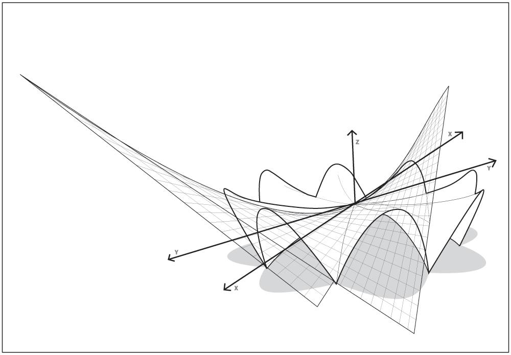

# Brief chronology of technological culture in Mexico

[RAFAEL LOZANO-HEMMER](http://lozano-hemmer.com) · Feburary 1, 2023

### This is an incomplete and idiosyncratic list of intersections of technology and culture in Mexico compiled by Rafael Lozano-Hemmer and Tracy Valcourt.

#### Banderoles and Volutes - ca 650 BC
In art history a speech scroll (also called a volute, banderole or phylactery) is an illustrative device denoting speech, song, or other types of sound. The device was in use by artists within Mesoamerican cultures from as early as 650 BC until after the in the Spanish conquest in the 16th century. While similar European medieval speech-scrolls were drawn as if they were an actual strip of parchment, Mesoamerican volutes follow the rules of fluid-dynamics such as Navier-Stokes equations, creating eddies and turbulence in the air.

#### Mayan Zero - ca 350
The number zero was used as a placeholder by Mayans over 100 years before it first was used algorithmically in India in 458. Contrary to the Indian zero, which represented emptiness or vacuum, in Mexico zero represented totality, everything.

#### Carlos de Sigüenza y Góngora - 1681
Polymath and writer Carlos de Sigüenza y Góngora wrote the book Philosophical Manifest Against the Comets Stripped of their Dominion over the Timid (1681) in which he categorically separates the fields of astrology and astronomy. His rationalist and anti-superstition treatise greatly influenced future generations of intellectuals.

#### Sor Juana Inés de la Cruz - 1692
Writer, philosopher, composer, and poet of the Baroque period, Sor Juana joined a Hieronymite nunnery in 1667, and began writing poetry and prose dealing with such topics as love, environmentalism, feminism, and religion. Her poem "Primero Sueño" (First Dream), written in 1692, is an ode to knowledge, clarity and rationalism.

#### Andrés Manuel del Río - 1801
Scientist Andrés Manuel del Río, author of the first mineralogy book in America, contemporary of Lavoisier and Von Humboldt, discovered the metallic element Vanadium from mineral samples from Hidalgo. Vanadium is a key component of many steel alloys, among other contemporary uses.

#### Ignacio Ramírez "El Nigromante" - 1836
Ignacio Ramírez was a writer, journalist, and politician born in San Miguel de Allende. He wrote the first public school textbooks, advocated for women to vote, and was known as a progressive and principled politician. In his speech in 1836 to the Letrán Academy, he proclaimed "God does not exist, natural beings are self-supporting".  This was two years before Darwin's theory of natural selection and forty-six before Nietzsche's proclaimed "God is dead" in "The Gay Science".

#### Julián Carrillo - 1895
Julián Carrillo was a composer from San Luis Potosí who proposed microtonal music in 1895,  using intervals smaller than half tones. He promoted and perfected his "Thirteenth sound" theory and in 1940 patented fifteen metamorphoser pianos to play his music, —these won the gold medal at the Brussels' World Expo in 1958. 

#### Estridentismo - Maples Arce, List Arzubide, Lira, Gallardo, and others - 1921 
Estridentismo (Stridentism), was an avant-garde artistic and techno-optimist movement founded by poet Manuel Maples Arce. The arrival of radio transmission in Mexico was spearheaded by this movement, who did the first radio broadcasts in the country starting in 1921. 

#### Xavier de Icaza - 1926
A Stridentist poet and writer from Durango, in 1926 Icaza wrote and produced “Magnavoz,”  a performance text in which voices were projected through loudspeakers placed in the craters of replicated Mexican volcanoes. The performance created one of the first polyphonic, multi-channel theatrical presentations.

#### David Alfaro Siqueiros - 1932
Siqueiros was known for his innovative approach to painting using industrial approaches such as synthetic paints, spray guns, photography, and cement "frescoes". In 1932 he was the first to use electric projections to trace his drawings to an architectural scale, and in 1933 he used cameras and projectors placed in the different locations of visitors to create the immersive and polyperspective work "Ejercicio Plástico" in Argentina.

#### Conlon Nancarrow - 1939
In 1939 composer Conlon Nancarrow began his works for mechanical player pianos, creating music which explored complex rhythmic variations beyond the ability of human performers. His polyphonic music derived from strata with different tempi, which required his pianos to be prepared and custom-built punching machines for his piano rolls. In 1947 he created a full robotic percussion orchestra, further bringing automation into his work.

#### González Camarena - 1940
Electrical engineer born in Guadalajara who invented the color-wheel type of colour television. At the age of 23, González Camarena patented a chromoscopic adapter with which black and white cameras of the day could capture color. This technology was later used in NASA's voyager mission to take pictures of Jupiter in 1979.

#### Arturo Rosenbleuth - 1943
Rosenbleuth was a researcher, physician and physiologist from Chihuahua, Director of the Mexican Institute of Cardiology. His publication “Behavior, Purpose, and Teleology” (1943), co-authored with American mathematician and philosopher Norbert Weiner, set the basis for the science of cybernetics.

#### Luis Miramontes - 1951
Eminent chemist from Nayarit, Miramontes worked at Mexico's Syntex Laboratory with Carl Djerassi and George Rosenkranz to synthesize norethisterone, the progestin used in one of the first oral contraceptives. "The Pill" has been lauded as one of the most important inventions of the 20th Century.

#### Félix Candela - 1951
Developed and perfected the use of thin shells of reinforced concrete, popularly known as "cascarones" (egg shells), which transformed modern architecture and structural engineering. His Pabellón de Rayos Cósmicos ("Pavilion of Cosmic Rays"), at the National Autonomous University of Mexico, was built in 1951.

#### Heberto Castillo - 1966
Civil engineer and political activist from Veracruz. Apart from founding three democratic socialist political parties, Castillo invented the "Tridilosa" a tetrahedral structure made of concrete and steel that is lightweight, resistant and materials-efficient. The structure has been used in hundreds of buildings and bridges, from the World Trade Center in Mexico City to Biosphere 2 in Arizona.

#### Juan García Esquivel - 1962
Born in Tampico, Esquivel was an electrical engineer, band leader, pianist and composer for television and films. "The King of Space Age Pop" is recognized for his pioneering use of remote stereo recording, in which he employed two bands recording simultaneously in separate studios, making the first telematic music recording.

#### Morton Heilig - 1955
Morton Heilig proposed total interactive immersion in his essay "Cinema of the Future", written while living in Cuernavaca in 1955. While in Mexico, he developed what many consider to be the first virtual reality experience, with his "Sensorama" Simulator which aimed to stimulate four of the five senses: sight, hearing, smell and touch. 

#### Mario Molina - 1974
Chilango chemist and activist who discovered the causes of the hole in the ozone layer in the Antartic, for which he received the Nobel Prize in Chemistry in 1995. Before dying in 2020 he was instrumental in identifying Covid-19 as an airborne virus with an article in the National Academy of Sciences.

#### Manuel Felguérez - 1975
Abstract artist from Zacatecas who worked with computer programming as early as 1975 and was the author of the seminal treatise on technological art "The Aesthetic Machine" written with mathematician Mayer Sasson published in 1983.

#### Maris Bustamente - 1979
Pioneering interdisciplinary artist active in performance, installations, television broadcasts and contraespectáculos (anti-shows), featuring critical, poetic, humorous, feminist work. As a commentary of the system of cultural property, identity and control, in 1979 she patented the Taco.
